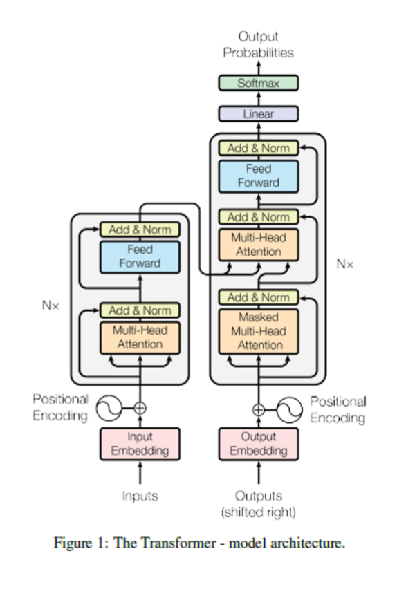

## Quiz 3 Notes

### predicted questions:
- what is attention related to? (as in what are the parameters for calculating it)
    - related to queries, keys, and values - all of these are vectors and at least the queries and keys have the same dimension d(k)
    - queries and keys are the things being compared 
    - the values are the things being combined based on the results of the comparisons
- how is multi-head attention different from normal? why do we use it?
    - attention mechanisms typically learn to focus on one aspect of the input
    - but for NLP tasks there's various aspects of the input that we need to pay attention to for different reasons
    - use multi-head attention
        - first queries, keys, and values are linearly projected using learned mappings
        - next, attention is applied in parallel to each result
        - outputs of the various attention mechanisms are then concatenated and again projected
    - pretty much consists of several dot-product attention layers running in parallel
- why are positional encodings important? what do they tell us and why is it okay if they're only added to the input?
    - without these, there is no way for a transfoormer to make use of the order of the input
    - therefore, it's necessary to inject some information about the relative or absolute position of the tokens in the sequence
- how does BERT differ from ELMo? 
    - based on transformers, not LSTMs (as ELMo was) to produce contextual embeddings
- what is BERT's first training objective 
    - involves randomly masking some tokens and then system tries to predict them based on their context
- what is BERT's second pre-training objective/task
    - system learns to predict whether the second sentence is the actual follow up sentence to the first
- why do we not replace all masked tokens with [MASK]
    - creates a mismatch between pre-training and fine-tuning since the [MASK] token does not appear during fine tuning
- how is BERT different than ELMo in fine-tuning?
    - unlike ELMo, the parameters learned during pretraining are not frozen so during fine-tuning, all BERT parameters are adjusted
- why is fine tuning preferable?
    - less expensive to train as you just take the big ass pretrained shit and then tune it to what you need
- what is one of the BERT subsidiaries and how does it differ from BERT?
    - RoBERTa uses 10x more pretraining data, trains for more epochs, and gets rid of the next sentence prediction (NSP) objective
- what is a masked language model
    - predicts tokens given context from both sides
- what are LLM scaling laws
    - performance is predictable to a high degree of accuracy as the number of parameters, training data, or computations used for training grows
- what is the difference between the encoder and the decoder
    - that decoder has an extra middle sublayer (masked mutli-head attention at top)
- what is zero-shot performance
    - focus is on zero-short performance = model was applied to various tasks without any fine tuning
- what is few-shot learning
    - method treats all tasks as autoregressive generation tasks using clever prompts
- zero-shot learning vs few-shot learning
    - zero-shot learning: prompts the system to perform a task
    - one-shot learning: adds a single example to the prompt whereas few-shot adds a few examples
- what is reinforcement learning from human feedback
    - trained on dataset from human volunteers
    - then train a rewarding model based on a training set consistening of actual responses and human rankings
- what is chain of thought prompting
    - method to elicit better reasoning for certain types of tasks from an LLM
- how is InstructGPT different from the previous GPT models?
    - previos GPT pretraining objective was standard language modeling on a standard, fixed dataset
    - involves a three-step process:
        1. fine-tune system using supervised ML 
        2. train a rewardal model using supervised ML to predict how good a response is
        3. use reward model and reinforcement learning to continue to fine-tune system; used proximal policy optimization (PPO)
    - all together procedure is known as reinforcement learning from human feedback
- what are emergent abilities
    - abilities that the models only gain after they become large enough
- what is explainable vs interpretable AI
    - interpretabyle AI = understanding the inner workings of a system
    - explainable AI = explaining predictions or decisions made by AI systems in human terms
- strong ai vs week ai
    - weak AI = machines can act intelligently (can be have as if they were intelligent)
    - strong AI = machines would actually be intelligent and actually be thinking

### Transformers

- pre-transformer era
    - through 2017 variations of RNNs (like LSTMs) dominated NLP literature
    - input sequences would be sequences of word embeddings or subword embeddings

    - encoder-decoder networks were used for sequence-to-sequence (seq2seq) tasks like machine translation (MT)
        - encodwer processes the input sequence and the decoder generates an output sequence
        - attention = allows decoder to focus on the portion of the encoder output htat seems most relevant at each time step
            - imprioves results significantly
            - cross-attention = applied to an encoder and used by a decoder

        - most systems used static word embeddings like those produced by word2vec or GloVe
        - ELMo used contextual word embeddings

    - shortcomings of RNNs and CNNs
        - RNNs (and LSTMs) must process input sequentially
        - this menas they can't be efficiently parallelized which prevents them from getting the full benefits of GPUs
        - leads to very slow training

    - CNNs have problems detecting long-distance dependencies
        - refers to relationships between elements that exist relatively far apart in an input sequence
        - in NLP it is often case that proper word requires knowledge of words from much earlier in sentence or previous sentences
        - with enough layers CNNs can handle this in theory
            - in pracitce they don't work work well when long-distance dependencies are significant

- transformers
    - "Attention is All You Need" paper presented at 2017 conference developed by Google researchers
        - introduces a novel neural architecture called a transformer
        - relies solely on attention mechanisms dispensing with recurrence and convolutions entirely
        - discusses the transformer as an encoder-decoder model

        

        - transformer is an example of an encoder-decoder network
            - encoder and decoder both rely on stacked layers
            - each layer has sublayers and residual connections (skip connections)
            - some of the sublayers rely on a concept called self-attention
            - others are point-wise fully-connected feedforward neural networks
            - decoder also uses cross attention applied to the encoder output
            - several later works relying on transformers only use the encoder portion (ex. BERT)
            - others only use the decoder portion (ex. GPT)

    - attention
        - related to queries, keys, and values
            - all of these are vectors and at least the queries and keys have the same dimension d(k)
        - queries and keys are the things being compared 
        - the values are the things being combined based on the results of the comparisons
        - in different contexts, two or even all three of these may be identical
        - transformer architecture in artcle uses scaled dot-product attention
            - without the scaling factor, additive attention (involved a learned weight matrix) performes better than a dot procut attention when d(k) is large
            - as the dot prouct grows large in magniture pushing the softmax function into regions where it has extremely small gradients
            - scaling factor alleviates this which is important since dot product attention is more efficient

    - multi-head attention
        - attention mechanisms typically learn to focus on one aspect of the input
        - but for NLP tasks there's various aspects of the input that we need to pay attention to for different reasons
        - use multi-head attention
            - first queries, keys, and values are linearly projected using learned mappings
            - next, attention is applied in parallel to each result
            - outputs of the various attention mechanisms are then concatenated and again projected
        - pretty much consists of several dot-product attention layers running in parallel

    - encoder
        - accepts the input which is a sequence of input embeddings combined with positional embeddings
        - in the original paper, it consists of 6 identical layers, each containing two sublayers
            - first sublayer = multi-head self-attention
                - paper didn't invent self-attention
                - each encoding is compared to every other and the weighted encodings are added together to form an output representation
                - a residual connection adds the input of the sublayer to its output & the sum is normalized
            - second sublayer = position-wise fully-connected feedforward neural network
                - consists of "two linear transformations with a ReLU actication in between"
                - weights are shared across positions within a layer but the weights differ between layers
                - a residual connection adds the input of the feedforward sublayer to its output and the sum is normalized

    - positional encodings
        - that little like sine wave that gets combined with the input
        - without these, there is no way for a transfoormer to make use of the order of the input
        - therefore, it's necessary to inject some information about the relative or absolute position of the tokens in the sequence
        - original paper uses sine and cosine functions of different frequencies producing vectors of the same dimension as the embeddings
            - are only added to the input embeddings directly
        - due to residual connections they have an effect throughout the stack
    
    - decoder
        - also accepts input sequence which is a sequence of embeddings + positional embeddings
        - during training the input sequence to  the decoder is the diseired output sequence of the seq2seq model shifted to the right
            - when we apply a transformer, each predicted value is used as the next input
        - like the encoder, it also consists of 6 identical layers
            - each layer consists of three sublayers
            - first sublayer = multi-head self-attention layer
                - sublayer is masked
                - pretty much same as encoder multi-head self-attention layer
            - second sublayer = performs multi-head attention over the output of the encoder stack
                - same sort of attention we learned about sometimes called cross-attention
            - third sublayer = position-wuse fully-connected feedforward neural network
                - same as second sublayer of encoder
        - decoder output is fed through a linear transformation layer and then a softmax layer to predict outputs
            - during training the predicted outputs would be compared to the desired outputs to calculate a loss function
    

- transformers for machine translation (MT)
    - network can be trained end-to-end using stochastic gradient descent and backpropagation
        - using a parallel corpus 
            - sentences from source language are fed to encoder
            - sentences from target language are fed to decoder
        - target sentences are "shifted right"
        - start of sentence marker is inserted as the first new token
        - masking = ensures that predictions for position i can depend only on the known outputs at positions less than i
            - self-attention sub-layer is modified in the decoder stack to prevent positions from attending to subsequent positions
    - during training each sentence pair can be trained in a single pass taking advantage of parallelization

    - applying a trained transformer to MT
        - need to run the decoder sequentially
        - each run of the system predicts one additional token (word or subword in this case)
        - during the first run, you feed in the source sentence to the encoder and only a start-of-sentence symbel to the decoder
            - decoder predicts the first word or subword of the target sentence
            - system remembers the first predicted token of the output
        - during the second run you feed in the source sentence to the encoder, and the start-of-sentence symbol + the first predicted token to the decoder
            - decoder predicts the second token of the target sentence -> system remembers it
            - system repeats this process until an end-of-sentence symbol is predicted

    - comparing architectures
        - he's got this big ass table with complexities, number of operations, max path length
        - n = length of sequence
        - d = size of each vector
        - k = kernel size (for convolutions)
        - r = window size for restricted self-attention
        - self-attention layers are faster than recurrent layers when the sequence length n is smaller than the representation dimensionality d
    
    - original results
        - transformers beat all previous architectures for both translation tasks
        - achieved state-of-the-art results at "a fraction of the training cost"
        - emphasis is more about the efficiency of transformers as opposed to the accuracy

### BERT and BERT variations

- Bidirectional Encoder Representations from Transformers (BERT)
    - based on transformers, not LSTMs (as ELMo was) to produce contextual embeddings
    - BERT uses only the encoder of a transformer
        - in general can be used for sequence labelling tasks and sequence classification tasks
    - BERT uses only one specific architecture for many NLP tasks
        - elmo produces contextual embeddings that are fed to other architectures

- tokenization
    - BERT implementation used WordPiece tokens
        - like BPE, the WordPiece algorithm leads to subword tokens that do not cross word boundaries
        - system considers the prediction for the word to be the label assigned to its first subword
    - position embeddings are necessary for the system to get any information that is dependent on word order
        - segment embedding indicates which sentence the corresponding token is a part of
    - original BERT paper fed two sentences at a time as input during pretraining
    - both the position embeddings and the segment embeddings are learned as a part of pre-training
    - the final input embedding for teach token is the sum of the WordPiece embedding, the position embeddings, abd the segment embedding

- pre-training
    - the developers pretrained their system for two tasks using unsupervised machine learning
    - pretrained a single transformer encoder for two seperate tasks at the same time
        - one task = language modelling task that ELMo and other systems are pretrained for
            - it's important to use context from both the left and the right of words at the same time
            - first training objective used for bert involves randomly masking some tokens and system tried to predict them
            - thus BERT = masked language model and objective = masked language modeling
        - second task = next sentence prediction (NSP)
            - input = two concatenated sentences with a sentence separator symbol in between
            - for training:
                - half the time the second sentence follows the first in the training corpus
                - other half of time the second sentence is a random sentence from the training corpus
            - system learns to predict whether the second sentence is the actual follow up sentence to the first
    - some later works found that NSP isn't actually that important to include as a pre-training objective

    - masking procedure
        - 15% of the WordPiece tokens from the training data, chosen randomly, are masked
        - allows to obtain a bidirectional pre-trained model
            - creating a mismatch between pre-training and fine-tuning since [MASK] token doesn't appear in fine tuning
            - thus don't always replace "masked" words with [MASK] token
        - 80% of masked tokens replaced with [MASK]
        - 10% of masked tokens replaced with a random token
        - 10% of masked tokens are not changed

    - input
        - consists of components concatenated together  
        - a special token [CLS] + input embeddings from sentence 1 (wordpiece token embedding + position embedding + segment embedding)
        - a sentence seperation token [SEP] + embeddings from sentence 2 (again adding all 3 components)
        - again 15% of tokens are masked
        - 50% of the time sentence 2 follows sentence 1 and the other 50% sentence 1 follows sentence 2
        - "sentences" are actaully more general spans of text, chosen s.t. the input sequence never exceeds 512 tokens
        - if the input sequence is shorter than 512 tokens, it must be padded (as it accepts fix-sized input)

    - process
        - training corpus consists of BookCorpus and English Wikipedia (abount 3.3 billion words in total)
        - loss functions were computed based on the following predictions
            - final hidden state corresponding to the [CLS] token is considered the "aggregate sequence representation for classification tasks"
            - during pretraining, this is used for NSP objective
            - final hidden states corresponding to masked tokens were used for the masked language modeling task
        - original paper created two systems:
            - BERT (base) = 12 transformer encoder layers, vectors of 768, and 12 self-attention heads (110 million trainable params)
            - BERT (large) = 24 transformer encoder layers, vectors of 1024, and 24 self-attention heads (340 million trainable params)
        - there's also other hyperparameters like batch size, learning rate, epochs, etc. which are described in the paper

- fine-tuning
    - unlike ELMo the purpose of BERT is not to produce contextual embeddings that can be fed into other architectures
    - the same architecture that has been used for pretraining can be **fine-tuned** for other tasks
    - is an example of **transfer-learning**
        - information learned for one task can also be useful for other related tasks
        - use of static word embeddings probabily fits the definition of transfer learning
        - term more often used when the model being used either stays the same or is slightly modified

    - SQuAD = reading comprehension dataset
        - task usually tackled is as a sequence labelling task applied to the appropriate passage
        - instead of feeding the system sentence 1 and sentence 2, the system is fed the question and the corresponding passage or paragraph that contains (or might contain) the answer
        - final hidden state corresponding the passage tokens are fed to two softmax layers
            - one predicts the prob that each token is the start of the answer
            - the other predicts the prob that each token is the end of the answer
        - for SQuAD 2.0 the system treats answers to unanswerable questions as starting and ending at the [CLS] token
    - for sequence labeling tasks that do not involve sentence pairs (POS tagging for ex.) the second sentence is left out
    - unlike ELMo, the parameters learned during pretraining are not frozen
        - during fine-tuning, all BERT parameters are adjusted
    - compared to pre-training, fine tuning is relatively inexpensive

- BERT experiments
    - the GLUE benchmark = collection of datasets related to tasks that seem to rely on natural language understanding
        - GLUE = general language understanding evaluation
        - a collection of diverse natural language understanding tasks
        - there are 9 datasets that comprise the GLUE benchmark
            - multi-genre natural language inference
            - quora question pairs (from the site lmfao)
            - question natural language inference
            - the stanford sentiment treebank
            - corpus of linguistic acceptability
            - semantic textual similarity benchmark
            - microsoft research paraphrase corpus
            - recognizing textual entailment
    - also used SQuAD dataset and SWAG (sittuations with adversarial generations dataset)
        - SWAG contains 113k sentence-pair completion examples that evaluate grounded commonsense inference

    - results
        - for all of the 11 tasks, BERT achieved state-of-the-art results
        - for some results it was a significant improvement over the last
        - this was achieved with a single common architecture
            - based on a transformer encoder BERT is pre-trained using unlabaled data for masked language modeling
            - in the original paper for next sentence prediction
            - same architecture is then fine-tuned using a smaller training set

- BERT variations
    - RoBERTa = a robustly optimized BERT pretraining approach
        - primarily uses the same architecture as BERT but it is pretrained differently
            - uses about 10x as much pretraining data
            - uses larger mini-batches
            - trains for more epochs
            - every few epochs it randomly geenrates masked tokens
            - does not use next sentence prediction as pretraining objective
        - achieved new state of the art results for everything BERT was also tested on
    - SpanBERT
        - masks out spans of text as opposed to individual tokens
        - pretraining task is to predict the masked spans based on the context
        - used the same pretraining dataset as BERT
        - did not use the next sentence prediction as an additional training objective
        - achieved better results than BERT on 14 of the 17 tasks

### LLMs, GPT, and RLHF

- large language models (LLMs)
    - language model = model that assigns a probability to a sequence of text
    - conventionally N-grams were used for this purpose
    - traditional language models (including neural language models) work left-to right predicting the next token in a sequence based on previous tokens
    - can also be used to generate text one token at a time
    - masked language models (BERT) predicts tokens given context from both sides
    - in general are pretrained based on some corpus of unlabeled natural language text using unsupervised machine learning approaches
    - no general agreement as to how big a language model needs to be in order to be considered a large language model

    - LLMs seem to obey **scaling laws**
    - performance is predictable to a high degree of accuracy as the number of parameters, training data, or computations used for training grows
    - can improve performance of an LLM in a predictable way by adding more parameters, training data, or more iterations of training
    - this is **only true** for performance as a language model

    - LLMs are not as predictable as a model grows (as to how they will perform for other tasks)
        - other abilities may face unpredictable diminsihing returns and some may even get worse
        - there are some examples of emergent abilities

- GPT-1
    - stands for generative pre-trained transformer
    - GPT is pretrained as a traditional language model (while bert is a masked language model)
    - GPT is built upon transformers
        - GPT-1 has about 117 million trainable parameters
    - can product contextual embeddings that can be used for other downstreamd tasks
    - built on a transformer decoder as opposed to the encoder (like BERT)
        - difference between encoder and decoder is that decoder has a middle sublayer
        - cross attention layer that attends to the output of the encoder
        - in decoder-only architecture this cannot exist
        - also self-attention layer is masked in a decoder
    - during training GPT uses a sort of masked multi-head self-attention
        - during pretraining the model does not look to the right

    - pretraining
        - consists of a 12-layer decoder-only trasnformer with masked self-attention heads
        - 12 attention heads were used in the original paper
        - self attention layer -> position-wise feed-forward sublayer
        - model pretrained using the BookCorpus
        - pretraining objective was standard language modeling (predict next token given previous token)
        - used BPE for tokenization (vocab of around 40,000)
        - pretrained for 100 epochs on minibatches of 64 randomly sampled contiguous sequences of 512 tokens

    - fine-tuning
        - used fine-tuning to apply the system to various downstream tasks
        - is an example of transfer learning
        - interesting note is that for all fine-tuning tasks, the fine-tuning includes language modeling (text prediction) as an auxillary fine-tuning objective

    - downstream tasks
        - straightforward classification tasks: input is text that needs to be classified
        - entailment tasks: input included both sentences or sequences being compared with a delimiter in between
        - similarity tasks: fed two sequence sbeing compared in both possible orders with a delimiter in between
        - multiple choice tasks: QA where possible answers are the choices
        - for all tasks, input starts and ends with special tokens and final hidden state of transformer (corresponds to the last input token) is passed to the linear layer

- GPT-2
    - introduced in 2019 by OpenAI
    - trained as a traditional language model using an OpenAI dataset known as WebText created by scraping ~45 million links
    - focus is on zero-short performance = model was applied to various tasks without any fine tuning
    - GPT-2 could perform autoregressive generation of text pretty well

- GPT-3
    - introduced in 2020 again by OpenAI
    - contains about 175 billion parameters (trainable weights)
    - basic architecture was mostly the same as previous versions of GPT
    - used a larger training corpus than the previous GPTs

    - few-shot-learning
        - does not involve fine tuning
        - rather a prompt is given to GPT-3 which shows examples of a pattern representing the type of task to solve
        - method treats all tasks as autoregressive generation tasks using clever prompts
        - no gradient updates are performed
    
    - zero-shot learning: prompts the system to perform a task
    - one-shot learning: adds a single example to the prompt whereas few-shot adds a few examples

- InstructGPT (GPT 3.5)
    - is a modified version of GPT-3 that was fine-tuned to do a better job at following instructions
    - involves a three-step process:
        1. fine-tune system using supervised ML 
        2. train a rewardal model using supervised ML to predict how good a response is
        3. use reward model and reinforcement learning to continue to fine-tune system; used proximal policy optimization (PPO)
    - all together procedure is known as reinforcement learning from human feedback

- Chain of thought prompting
    - method to elicit better reasoning for certain types of tasks from an LLM
    - by including a sentence such as "lets think step by step" to the end of a prompt instead of a request for the answer directly the perforamnce improves significantly
    - causes LLM to provide an explanation to the answer that is helpful for the user
    - can be used to improve the performance of few-shot learning

- Emergent Abilities
    - abilities that the models only gain after they become large enough
    - few-shot learning and CoT prompting are both emergent abilities
    - some studies found that these abilities are not present at all when tested on samller models

### Ethics and Philosophy
- ethics = branch of philosophy

- problems with chatbots
    - they can be blatantly offensive
    - they learned to emulate sexist, racist, and blatantly offensive behavior
    - there's issues with chatbots relating to privacy 
        - LLM could reveal passwords that appeared in training data
        - chatbot might revel personal/private information to a user
    - could also be used to write essays / computer code
    - they could also hallucinate or generate misinformation

- word embedding bias
    - static word embeddings can be used to solve analogies
    - occupations sorted by he/she pronouns
    - embeddings amplify biases present in language

    - contextual embeddings
        - gender and racial biases exist in contextual embeddings as well as in sentence embeddings
        - intersectional biases = biases related to terms or names associated with people who belong to multiple underrepresented groups
        - intersectional could be > than sum(individual biases)

- debiasing
    - Bulukbasi discusses a debiasing technique -> pushes biased embeddings closer to the center of 'he' and 'she'
    - authors show that this can be done in a way to reduce the bias while keeping embeddings useful for certain tasks like solving analogies
    - certain words like 'grandfather' or 'grandmother' should not be debiased
        - gender-neutral words should be debiased
        - gender-specific words shouldn't be debiased

- general
    - representational harm = harm caused by a system demeaning or even ignoring some social groups
    - historical embeddings = word embeddings trained on data from the past
        - can measure biases that were present in previous time periods

- machine translation
    - biased embeddings can specifically affect modern MT systems
        - some languages have gender-neutral pronouns which can be translated to a language without them
        - such systems often default to the male gender or base their decisions on cultural stereotypes
    - there aren't a lot of large parallel training texts available
        - many MT approaches focus on the case where one of the languages is english

- measuring bias
    - how can the degrees of biases of different language models be compared?
    - researchers created Context Association Tests (CATs)
        - in one type, predict the best word to fill in a blank given three choices
        - in another type predict the best follow-up sentence given a sentence again given three choices
        - for both types, three choices = stereotype, anti-stereotype, and unrelated

- explaining predictions
    - machine learning in general is used to make predictions and are often considered to be black boxes
    - may lead to ethical issues when such systems are used to make important decisions like which applicant gets chosen for an interview
    - general goal to explain decisions made by ML systems
        - interpretabyle AI = understanding the inner workings of a system
        - explainable AI = explaining predictions or decisions made by AI systems in human terms
    - human explanations are often contrastive and may involve back and forth communication

- BERTology
    - specifically relevant to modern NLP, some researchers have attepmted to understand why BERT makes the predictions that it makes
    - field of study is sometimes referred to as BERTology
    - considered to fall in the real of xAI

- Stochastic Parrots
   - paper that delivers a long list of criticisms of BERT-like language models like:
        - they're bad for the environment (training a single BERT base model is estimated to use as much energy as a trans-American flight)
        - massive training data sometimes leads to encoded and amplified biases
        - slow to adapt to changing social views
        - cannot communicate back and forth
        - there is "no actual language understanding" taking place
- Turing test
    - potential test for intelligence
    - a computer/person communicating with an expert located in another room
    - another human coordinator would be necessary to exchange messages between the agent and the tester
    - today can imagine the tester communicating with the computer or person over a network

    - humans are intelligent based on our communication with others
    - if a machine can fool an expert into thinking it is human by passing its test, we should consider it ot be intelligent
        - if an agent passes the test it should be considered intelligent
        - turing wanted it to have a sort of fixed time limit

        - "head in the sand objection" = machine thinking would be too dreadful so lets hope they cannot be
        - "continuity of nervous system" = nervous system is not a discrete machine

- weak and strong AI
    - weak AI = machines can act intelligently (can be have as if they were intelligent)
    - strong AI = machines would actually be intelligent and actually be thinking
        - supporters say there is no distinction between what a computer is capable of and what a brain is capable of

